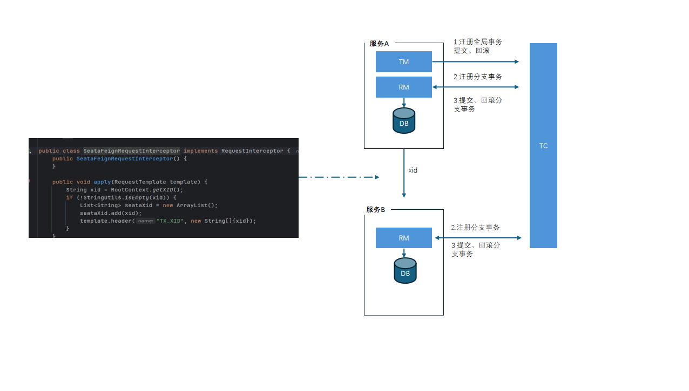

# g-not
郭的笔记
# 1.customeLock
```java 
        CustomLock lock = new CustomLock();
        CountDownLatch latch = new CountDownLatch(2);

        // 线程1获取锁
        new Thread(() -> {
            lock.lock();
            try {
                System.out.println("线程1获取自定义锁");
                TimeUnit.MILLISECONDS.sleep(300);
            } catch (InterruptedException e) {
                e.printStackTrace();
            } finally {
                lock.unlock();
                System.out.println("线程1释放自定义锁");
                latch.countDown();
            }
        }).start();
```

# 2.秒杀
* 基础版本
* 分布式锁版本
* redis+lua脚本版本
# 3.jmeter工具

# 4.java启动命令

```bash 
nohup java -Xms512m -Xmx1024m \
-XX:+UseG1GC \
-XX:MetaspaceSize=256m \
-XX:MaxMetaspaceSize=512m \
-XX:-UseCompressedClassPointers \
-Xlog:gc*=info:file=./logs/gc.log:time,uptime,pid:filecount=5,filesize=100M \
-XX:+HeapDumpOnOutOfMemoryError \
-XX:HeapDumpPath=./logs/heapdump.hprof \
-jar concurrency-in-practice-0.0.1-SNAPSHOT.jar > ./logs/app.log 2>&1 &
```

# 5.redisson源码分析

# 6.seata源码分析
